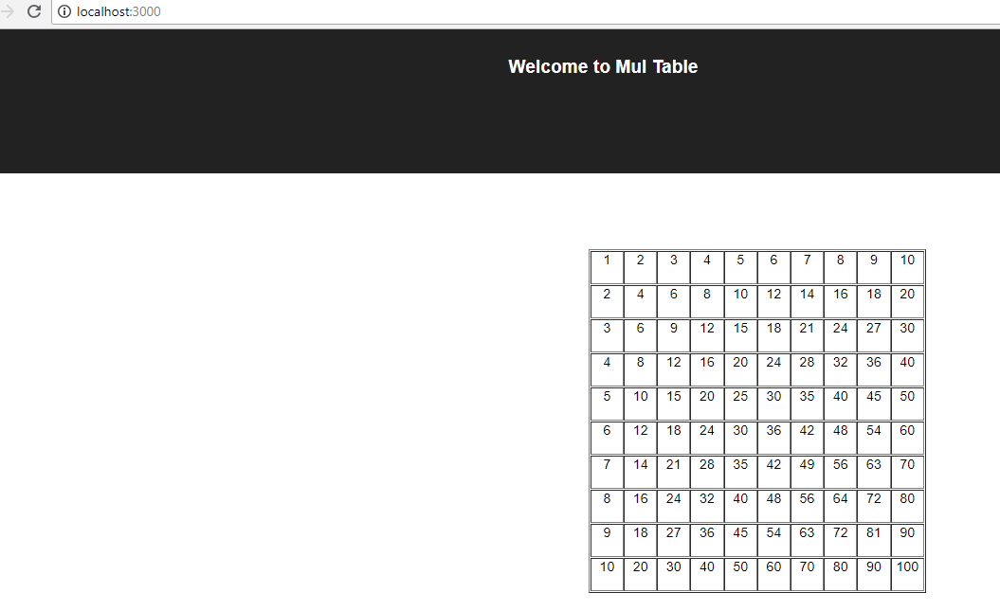

# Mul-Table project in react

## To run this project in local dev mode:
* run in the node cli (the must to be in the project folder ):
```bash
npm i
```

* run the project in your browser:
```bash
npm start
```

* open the browser in `http://localhost:3000/` and see the following result:



